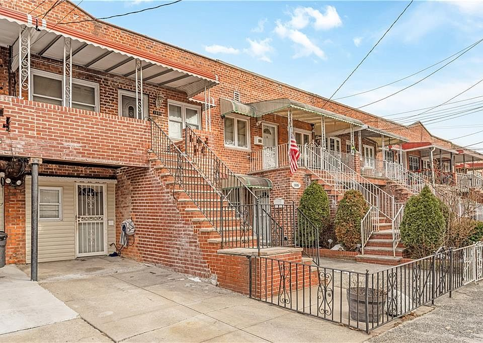

```{=html}
<div class="site-shell">
  <section class="hero" aria-labelledby="hero-title">
    <div class="hero-copy">
      <p class="eyebrow"><span class="status-dot" aria-hidden="true"></span> IGOR IASEVYCH · BOSTON, MA</p>
      <h1 id="hero-title">Turning data into<br><em>better decisions.</em></h1>
      <p class="hero-role">Strategy &amp; operations. Finance. Applied analytics.</p>
      <p class="hero-intro">I connect the numbers to the bigger picture — bringing a decade of business experience to the questions that data can answer.</p>
      <div class="button-row">
        <a class="btn-primary-custom" href="#selected-work">Explore my work <span aria-hidden="true">↘</span></a>
        <a class="btn-text" href="https://www.linkedin.com/in/igoriasevych/" target="_blank" rel="noopener noreferrer">Connect on LinkedIn <span aria-hidden="true">↗</span></a>
      </div>
      <div class="hero-footnote"><span class="small-label">CURRENTLY STUDYING</span><span>MS Applied Business Analytics · Boston University</span></div>
    </div>
    <figure class="portrait-wrap">
      
      <figcaption class="portrait-caption"><span>Business perspective.<br>Analytical depth.</span><span class="portrait-mark" aria-hidden="true">↗</span></figcaption>
      <span class="portrait-index" aria-hidden="true">01 / A LITTLE ABOUT ME</span>
    </figure>
  </section>

  <div class="experience-strip" aria-label="Selected previous employers">
    <span class="small-label">EXPERIENCE ACROSS</span>
    <span>AliExpress</span><span>Sberbank</span><span>Lamoda</span><span>PwC &amp; KPMG</span>
  </div>

  <section class="section-block" id="selected-work" aria-labelledby="work-heading">
    <div class="section-heading"><div><p class="eyebrow">THE PORTFOLIO</p><h2 id="work-heading">Selected work<span class="accent-dot">.</span></h2></div><span class="section-note">From business question to a decision.</span></div>
    <a class="featured-project reveal" href="projects/canarsie.qmd" aria-label="Read the Canarsie real estate case study">
      <div class="featured-image"><span class="image-label">BROOKLYN, NEW YORK</span></div>
      <div class="featured-copy"><div class="project-topline"><span class="eyebrow">PROJECT 01</span><span class="project-status">Completed</span></div><h3>Canarsie.<br>A market worth entering?</h3><p>A real estate market study connecting neighborhood segmentation, pricing models, and forecasting to a brokerage investment decision.</p><div class="tag-row"><span>R</span><span>Clustering</span><span>Regression</span><span>Forecasting</span></div><div class="project-facts"><div><strong>2.08M</strong><span>source records</span></div><div><strong>84</strong><span>business configurations</span></div></div><span class="case-link">Read the case study <span aria-hidden="true">↗</span></span></div>
    </a>
    <div class="upcoming-grid">
      <a href="projects/project-2.qmd" class="upcoming-card reveal"><div class="project-topline"><span class="eyebrow">PROJECT 02</span><span class="project-status muted">Coming soon</span></div><h3>Project 2</h3><p>A space for the next question.</p><span class="card-arrow" aria-hidden="true">↗</span></a>
      <a href="projects/project-3.qmd" class="upcoming-card reveal"><div class="project-topline"><span class="eyebrow">PROJECT 03</span><span class="project-status muted">Coming soon</span></div><h3>Project 3</h3><p>A space for the next discovery.</p><span class="card-arrow" aria-hidden="true">↗</span></a>
    </div>
  </section>

  <section class="section-block approach-section" aria-labelledby="approach-heading">
    <div class="section-heading"><div><p class="eyebrow">HOW I THINK</p><h2 id="approach-heading">Business first. Evidence always.</h2></div></div>
    <div class="approach-grid"><article class="reveal"><span class="approach-number">01</span><h3>Frame the question.</h3><p>Start with the decision, the customer, and the constraints. Define what a useful answer needs to change.</p></article><article class="reveal"><span class="approach-number">02</span><h3>Find the signal.</h3><p>Clean the data, test the assumptions, and choose methods that fit the question. Keep uncertainty visible.</p></article><article class="reveal"><span class="approach-number">03</span><h3>Make it actionable.</h3><p>Translate the analysis into a recommendation, with clear trade-offs and a plan for what to do next.</p></article></div>
  </section>

  <section class="contact-band reveal" aria-labelledby="contact-heading"><div><p class="eyebrow">LET'S CONNECT</p><h2 id="contact-heading">Good questions deserve<br><em>thoughtful answers.</em></h2><p>Interested in strategy, analytics, or building something useful?</p></div><div class="contact-actions"><a class="btn-light" href="mailto:iiasevych@gmail.com">Get in touch <span aria-hidden="true">↗</span></a><a href="CV.pdf" target="_blank" rel="noopener">View my CV <span aria-hidden="true">↗</span></a></div></section>
</div>
```
