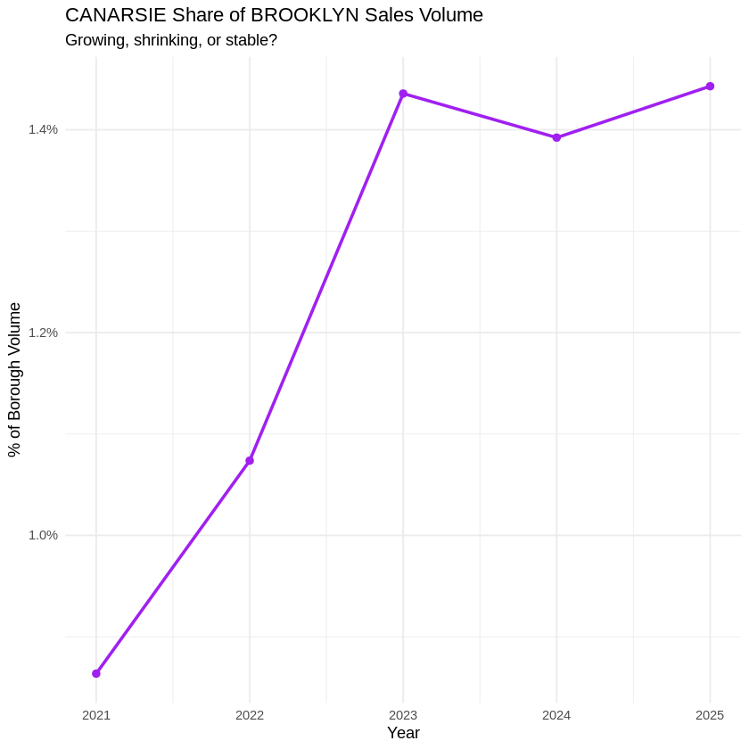
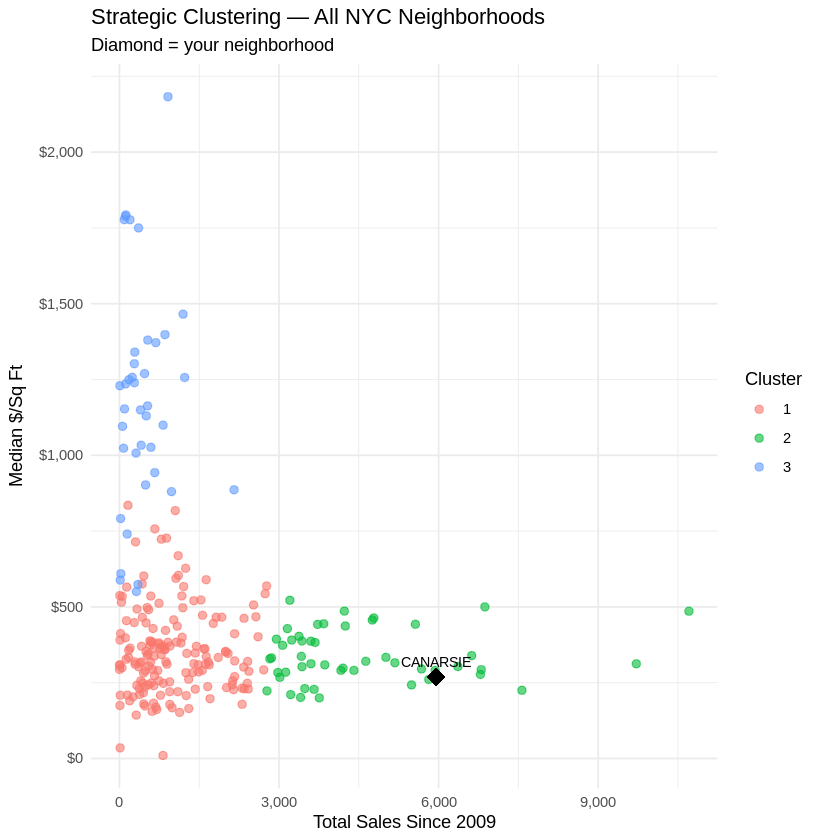
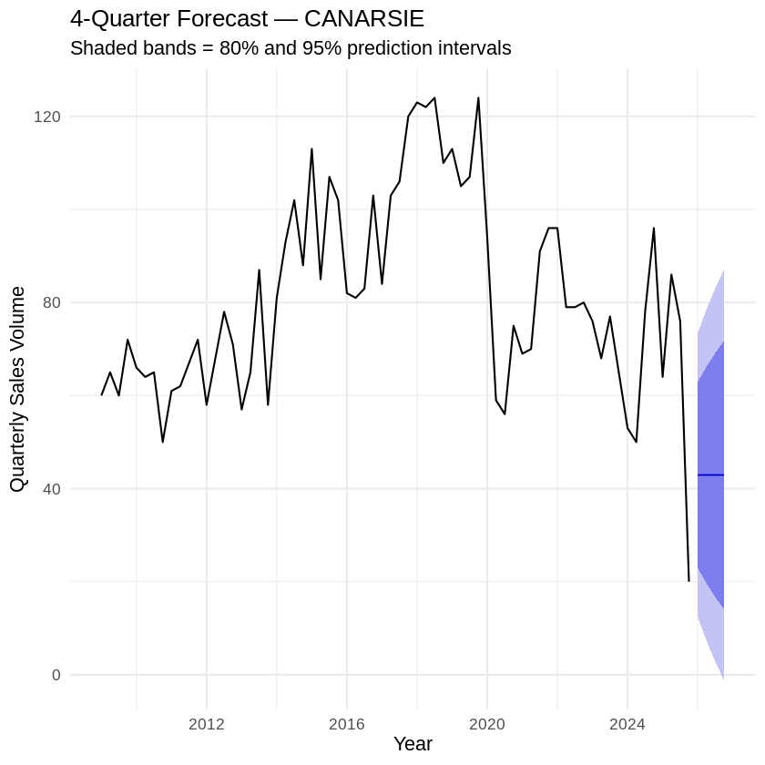
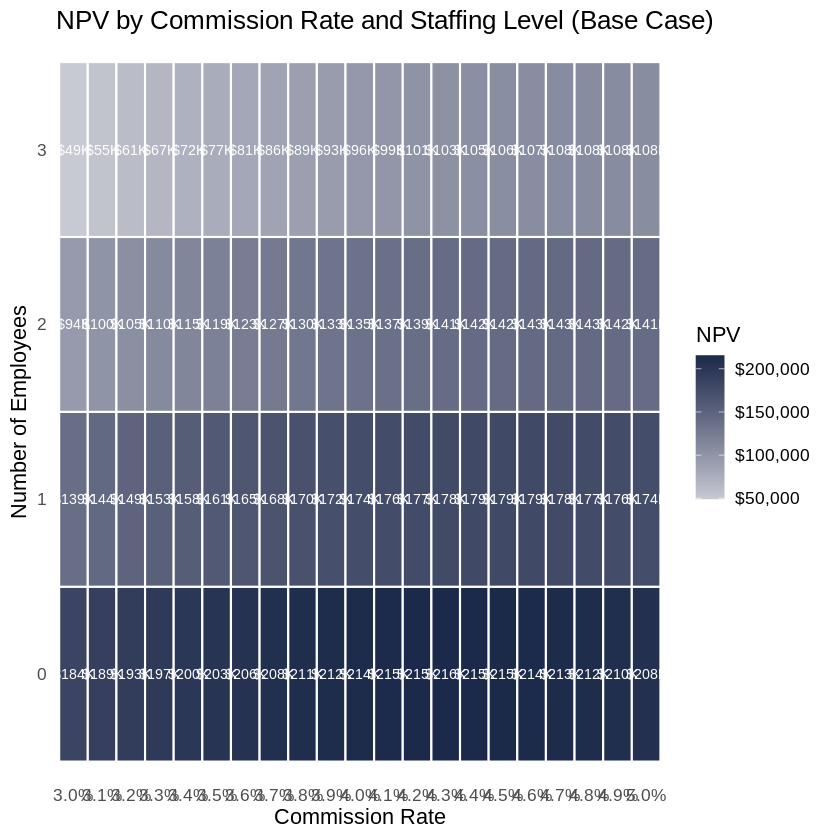

```{=html}
<div class="site-shell case-study">
  <a class="back-link" href="../index.qmd#selected-work">← All projects</a>
  <header class="case-hero"><p class="eyebrow">PROJECT 01 · BOSTON UNIVERSITY · AD 571</p><h1>Canarsie.<br><em>A market worth entering?</em></h1><p class="lead-copy">Should a real estate brokerage open an office in this Brooklyn neighborhood? I used market data, statistical models, and financial scenarios to turn that question into a conditional recommendation.</p><div class="case-meta"><div><span class="small-label">FOCUS</span><span>Real estate market entry</span></div><div><span class="small-label">METHODS</span><span>Clustering · Regression · ETS · NPV</span></div><div><span class="small-label">TOOLS</span><span>R · tidyverse · forecast · Excel</span></div><div><span class="small-label">AUTHOR</span><span>Igor Iasevych · 2026</span></div></div></header>
  <figure class="case-cover"><figcaption>Canarsie, Brooklyn · Neighborhood image from the original project presentation.</figcaption></figure>
  <nav class="case-nav" aria-label="Case study sections"><a href="#overview">Overview</a><a href="#segmentation">Segmentation</a><a href="#pricing">Pricing</a><a href="#forecast">Forecast</a><a href="#decision">The decision</a><a href="#resources">Resources</a></nav>

  <section class="case-section" id="overview"><div class="section-heading"><div><p class="eyebrow">01 / THE QUESTION &amp; THE DATA</p><h2>A local decision.<br>A citywide perspective.</h2></div></div><div class="case-columns"><p class="lead-copy">An attractive neighborhood is only the starting point. A viable brokerage also needs enough transactions, a clear target segment, and a cost structure that can survive a slower market.</p><div><p>The project follows the A1–A5 analytical sequence: describe the market, compare neighborhoods, model prices, forecast activity, and evaluate the business decision.</p><p>I began with 2,083,757 NYC sale records. Cleaning removed non-residential and invalid price or area records; the A1 Canarsie sample also applied a $10,000 price floor and an area filter, leaving 5,580 transactions from 2009 onward. Samples differ between analytical stages.</p></div></div><div class="metric-grid"><div><strong>2.08M</strong><span>raw NYC sale records</span></div><div><strong>256</strong><span>neighborhoods compared</span></div><div><strong>5,580</strong><span>A1 Canarsie transactions</span></div><div><strong>68</strong><span>quarterly observations</span></div></div><div class="finding-callout"><span class="small-label">THE MARKET SIGNAL</span><p>92.7% of recorded local transactions with positive prices were residential. Canarsie's share of Brooklyn's residential dollar sales volume rose from roughly 1% in 2021 to more than 1.4% in 2025.</p></div><figure class="chart-figure"><button type="button" class="chart-button" data-expand-chart aria-label="Expand chart of Canarsie's share of Brooklyn residential sales volume"><span class="expand-label" aria-hidden="true">Expand ↗</span></button><figcaption>A1 · Neighborhood share of Brooklyn's residential sales volume, 2021–2025. Original saved notebook output.</figcaption></figure></section>

  <section class="case-section" id="segmentation"><div class="section-heading"><div><p class="eyebrow">02 / FIND THE RIGHT SEGMENT</p><h2>Start with the market's backbone.</h2></div></div><div class="case-columns"><div><h3>A middle-market position.</h3><p>I standardized neighborhood median price, transaction count, median price per square foot, and price variability before applying k-means with three clusters. Canarsie sits in the Mid-Market cluster, whose average transaction count was the highest of the three groups.</p></div><div><h3>A focused entry strategy.</h3><p>A second clustering exercise grouped Canarsie properties by sale price, size, and residential units. The Standard segment accounts for 48.3% of the sample, making it the largest potential listing pool.</p></div></div><div class="segment-grid"><article class="segment-card featured-segment"><span class="small-label">PRIMARY TARGET</span><h3>Standard</h3><strong>48.3<span>%</span></strong><p>Typical two-family homes</p><dl><dt>Median sale price</dt><dd>$478,091</dd><dt>Median area</dt><dd>1,764 sq ft</dd></dl></article><article class="segment-card"><span class="small-label">SEGMENT 02</span><h3>Premium</h3><strong>25.9<span>%</span></strong><p>Larger multi-unit properties</p><dl><dt>Median sale price</dt><dd>$744,740</dd><dt>Median area</dt><dd>2,760 sq ft</dd></dl></article><article class="segment-card"><span class="small-label">SEGMENT 03</span><h3>Entry</h3><strong>25.8<span>%</span></strong><p>Single-family starter homes</p><dl><dt>Median sale price</dt><dd>$415,000</dd><dt>Median area</dt><dd>1,201 sq ft</dd></dl></article></div><figure class="chart-figure"><button type="button" class="chart-button" data-expand-chart aria-label="Expand chart of NYC neighborhood clusters"><span class="expand-label" aria-hidden="true">Expand ↗</span></button><figcaption>A1 · Citywide neighborhood clusters. Features were scaled before clustering; Canarsie is highlighted.</figcaption></figure></section>

  <section class="case-section" id="pricing"><div class="section-heading"><div><p class="eyebrow">03 / UNDERSTAND THE PRICE DRIVERS</p><h2>Structure matters.<br>Local knowledge still matters.</h2></div></div><div class="case-columns"><div><p class="lead-copy">The A1 median sale price was $525,000, close to the $535,838 mean. But a compact average tells us less about an individual home than it first appears.</p><p>The local regression modeled price per square foot using sale year, year built, residential units, and building class. The final model used 5,490 observations, with adjusted R² of 0.3616 and residual standard error of $113.99 per square foot.</p></div><div class="model-summary"><div><span>Adjusted R²</span><strong>0.362</strong></div><div><span>Residual standard error</span><strong>$113.99 / sq ft</strong></div><div><span>Mean citywide-model residual in Canarsie</span><strong>−$80.45 / sq ft</strong></div></div></div><div class="table-wrap"><table class="editorial-table"><caption>Selected associations in the local pricing model</caption><thead><tr><th scope="col">Predictor</th><th scope="col">Coefficient</th><th scope="col">Interpretation</th></tr></thead><tbody><tr><th scope="row">Sale year</th><td>+$16.04 / sq ft</td><td>Per additional calendar year, holding other model variables fixed.</td></tr><tr><th scope="row">Year built</th><td>−$0.65 / sq ft</td><td>Per year newer; an association, rather than evidence that newer construction causes lower prices.</td></tr><tr><th scope="row">Residential units</th><td>−$14.37 / sq ft</td><td>Per additional unit, holding other model variables fixed.</td></tr><tr><th scope="row">Three-family building class</th><td>−$98.68 / sq ft</td><td>Relative to the original model's A1 building-class reference category.</td></tr></tbody></table></div><div class="finding-callout"><span class="small-label">WHAT THIS CHANGES</span><p>A generic citywide model systematically overpredicted Canarsie prices. The local model improves context but leaves substantial unexplained variation, supporting inspection and local expertise alongside analytical tools.</p></div><p class="source-note">The notebook also tests a B1 reference category. The coefficient shown above comes from the original A1-reference model; changing the reference changes the building-class coefficients, not the fitted predictions. The A1 price coefficient of variation is 0.46 in the saved calculation.</p></section>

  <section class="case-section" id="forecast"><div class="section-heading"><div><p class="eyebrow">04 / KEEP UNCERTAINTY VISIBLE</p><h2>The forecast is a range.<br>The decision needs a trigger.</h2></div></div><div class="case-columns"><div><p class="lead-copy">The ETS(A,N,N) model projects about 43 transactions per quarter in 2026. Its prediction intervals widen substantially over the year.</p><p>The 68-quarter series spans Q1 2009 to Q4 2025. The fitted model uses additive errors with no trend or seasonal component. Training RMSE was 15.34 transactions; the residual Ljung–Box test returned p = 0.6309.</p></div><div><p>Those diagnostics support the fitted specification, but do not guarantee future demand. The business recommendation therefore includes an early monitoring trigger: reconsider entry if Q1 activity approaches the conservative case of about 12 transactions.</p><p class="source-note">The unconstrained ETS model's Q4 lower 95% bound is approximately −1.2 transactions. Counts cannot be negative. This highlights the limits of that model; the original assignment's scenario outputs below are retained as reported.</p></div></div><figure class="chart-figure"><button type="button" class="chart-button" data-expand-chart aria-label="Expand Canarsie 2026 sales forecast chart"><span class="expand-label" aria-hidden="true">Expand ↗</span></button><figcaption>A4 · The original ETS forecast, with 80% and 95% prediction intervals.</figcaption></figure><div class="table-wrap"><table class="editorial-table"><caption>2026 forecast · rounded notebook outputs</caption><thead><tr><th scope="col">Quarter</th><th scope="col">Point forecast</th><th scope="col">Lower 95%</th><th scope="col">Upper 95%</th></tr></thead><tbody><tr><th scope="row">Q1</th><td>43</td><td>12</td><td>73</td></tr><tr><th scope="row">Q2</th><td>43</td><td>7</td><td>79</td></tr><tr><th scope="row">Q3</th><td>43</td><td>3</td><td>83</td></tr><tr><th scope="row">Q4</th><td>43</td><td>−1</td><td>87</td></tr></tbody></table></div></section>

  <section class="case-section" id="decision"><div class="section-heading"><div><p class="eyebrow">05 / THE BUSINESS DECISION</p><h2>Enter lean.<br><em>Watch the downside.</em></h2></div></div><p class="lead-copy narrow-copy">The assignment model favors entry at a 4.3% commission rate with zero salaried employees. That configuration maximizes base-case NPV, but the downside scenario turns negative.</p><div class="scenario-panel"><div class="scenario-panel-top"><p class="eyebrow">EXPLORE THE ORIGINAL SCENARIOS</p><div class="scenario-controls" role="group" aria-label="Choose a market scenario"><button type="button" data-scenario="low" aria-pressed="false">Conservative</button><button type="button" data-scenario="base" aria-pressed="true">Base case</button><button type="button" data-scenario="high" aria-pressed="false">Optimistic</button></div></div><div class="scenario-result" aria-live="polite" aria-atomic="true"><div><span id="scenario-label">Base case NPV</span><strong id="scenario-npv">$215,512</strong><p id="scenario-description">Positive modeled returns at the point forecast. Enter with a lean operating structure and monitor market activity.</p></div><div class="scenario-config"><div><strong>4.3%</strong><span>commission</span></div><div><strong>0</strong><span>salaried employees</span></div><div><strong>6.6%</strong><span>modeled penetration</span></div></div></div><div class="scenario-scale" aria-label="Net present value across all three scenarios"><div data-scenario-marker="low"><span>Conservative</span><strong>−$72,649</strong></div><div class="is-selected" data-scenario-marker="base"><span>Base case</span><strong>$215,512</strong></div><div data-scenario-marker="high"><span>Optimistic</span><strong>$503,713</strong></div></div><p class="source-note">All three cases remain visible. Selecting a scenario highlights its reported result; it does not recompute the model. These are academic model outputs under assignment assumptions.</p></div><div class="case-columns"><div><h3>The trade-off.</h3><p>The search evaluated 21 commission rates from 3.0% to 5.0% against four staffing levels, for 84 combinations. Lower commissions improved modeled penetration but reduced revenue per deal. Hiring added salary expense that outweighed the assumed penetration gain.</p></div><div><h3>The operating response.</h3><p>Use Standard-segment listings as the initial focus. Track actual transaction activity early, and pause or reassess the office if the market follows the conservative path. Configuration stability across scenarios does not make the investment outcome robust.</p></div></div><details class="method-details"><summary>Model assumptions &amp; limitations</summary><div><p>The A5 model values four quarters of operating profit at a 1.5% quarterly discount rate. It uses a 2025 average residential deal price of $707,554, a 250 sq ft office, a $65,000 annual salary per employee, and an $8,000 monthly operating budget.</p><p>Monthly rent is a proxy: 2% of the median commercial sale price per square foot ($374.57), multiplied by office area. This is an assignment assumption, not an observed lease quote. Market penetration is an assumed function of commission and staffing.</p><p>The reported NPV is the discounted sum of modeled operating profits. The function does not subtract a separate upfront investment. Forecast bounds, rent, penetration, and average prices need validation before a real investment decision.</p></div></details><figure class="chart-figure"><button type="button" class="chart-button" data-expand-chart aria-label="Expand NPV sensitivity heatmap"><span class="expand-label" aria-hidden="true">Expand ↗</span></button><figcaption>A5 · Original sensitivity analysis across the commission and staffing grid.</figcaption></figure></section>

  <section class="case-section" id="resources"><div class="section-heading"><div><p class="eyebrow">06 / EXPLORE THE WORK</p><h2>The analysis behind the recommendation.</h2></div></div><p>The case study summarizes the saved project files. Download the originals to review the code, full outputs, presentation, and regression workbook.</p><div class="resource-grid"><a href="../Canarsie/iigor_A1-5_CANARSIE.ipynb" download><span class="resource-type">IPYNB · R NOTEBOOK</span><h3>Full analysis</h3><p>A1–A5 code and saved results</p><span aria-hidden="true">↓</span></a><a href="../Canarsie/iigor_CANARSIE.pptx" download><span class="resource-type">PPTX</span><h3>Presentation</h3><p>Market story and recommendation</p><span aria-hidden="true">↓</span></a><a href="../Canarsie/iigor_CANARSIE.docx" download><span class="resource-type">DOCX</span><h3>Project write-up</h3><p>Original presentation narrative</p><span aria-hidden="true">↓</span></a><a href="../Canarsie/iigor_Canarsie.xlsx" download><span class="resource-type">XLSX</span><h3>Regression workbook</h3><p>Supporting coefficient tables</p><span aria-hidden="true">↓</span></a></div><p class="source-note">Figures and results are taken from my supplied Canarsie project. Raw and cleaned samples differ by section; the original files remain unchanged. The project studies historical data through 2025 and a model-based 2026 forecast.</p></section>
  <div class="next-project"><span class="eyebrow">UP NEXT</span><a href="project-2.qmd">Project 2 <span>Coming soon ↗</span></a></div>
</div>
```
